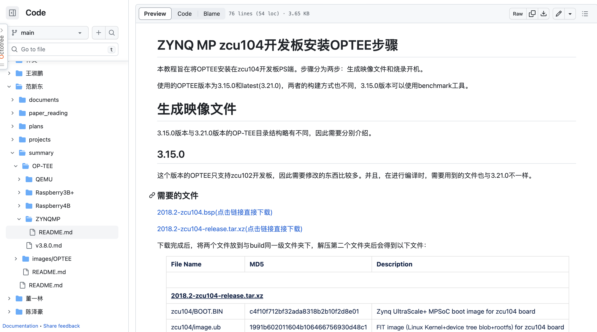
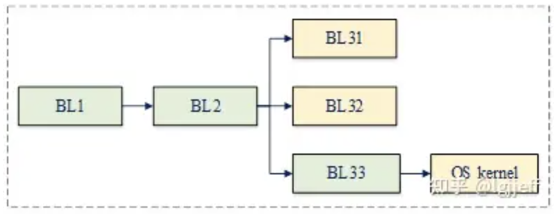

# TF-FPGA计划

在FPGA开发板上基于TrustZone构建可信执行环境，初步规划是构建一个轻量级的TEEOS，类似于[IceClave](https://dl.acm.org/doi/pdf/10.1145/3466752.3480109)。

# 工作框架

## 调研
IceClave的工作与当前工作相似度较高，因此需要学习论文的研究思路。

## TZ接口的汇总统一
目前主要的工作方向是基于TZ构建TEEOS，因此需要将TZ的接口进行汇总，并且在选择版本时，组内成员要进行一个统一。

# 思维导图
目前工作的思维导图如下所示：

可以看到，TZ-FPGA分为三个部分：
+ TZ端TEE
+ FPGA端TEE
+ TZ和FPGA之间的安全通信

## TZ端TEE
在TZ端，我们需要设计出一个轻量级的TEE OS，它能够支持运行（开发）可信的应用程序。并且能够控制与FPGA之间的**安全通信**，例如对数据进行加密并发送；接受返回结果并且进行解密。

## FPGA端TEE
在FPGA端建立TEE主要是依据其物理不可复制功能（PUF）来建立信任根的。在此端需要设计一个安全监视器，负责数据的通信、加解密以及分发。

## TZ和FPGA之间的安全通信
为了确保数据在传输的过程中不被窃取、修改或破坏，需要在数据传输之前对数据进行加密，并且添加数据认证机制防止数据被修改或破坏。

# 架构图（截止23.3.28）
架构图如下所示：

# 研究思路（23.4.13）
分成四个部分：
+ 查找相关文献。重点放在我们到底面临什么样的安全威胁、威胁模型以及其他文章是怎么做的。
+ 查找相关的应用。例如在PS端需要TEE保护的同时在PL端需要加速的应用，找出应用场景。
+ 搭建示例平台。利用相关的TrustOS场景，例如OPTEE在PS端搭建起可信执行平台，进行相关的评估测试。
+ 构建创新架构。利用上述学习到的知识，同时针对我们目前所面临的安全问题、应用场景搭建创新架构。

# 小组汇报（23.5.16）
当前有两个研究思路：
+ 寻找FPGA区块链、FPGA神经网络加速等应用，考虑如何分割任务，包括将隐私数据分离，同时考虑性能下降在可容忍的范围内；
+ 将现有的可信执行环境在zcu104板子上运行。

本人负责探究第二个研究思路

## 背景

当我们使用FPGA对应用程序例如神经网络、区块链进行加速时，一些隐私数据例如支付信息、用户个人信息、敏感数据集等等通常被当作普通数据来管理，这是非常危险的。因此，需要将这些特殊的数据区别对待。而同态加密、安全多方计算、差分隐私、联邦学习、零知识证明和可信执行环境是针对使用敏感数据时降低隐私风险的有效隐私技术。

Xilinx的Zynq MP开发板是一种基于FPGA技术的开发板，它可以帮助我们快速开发各种应用。通俗来说，就是它是一种可以自由编程的硬件平台，可以根据我们的需求来设计和实现各种功能。Zynq MP开发板不仅包含了FPGA芯片，还集成了ARM处理器和其他外设，这意味着我们可以在FPGA和ARM之间灵活地切换，从而实现更复杂的应用。比如，我们可以通过Zynq MP开发板来实现机器人控制、车载视觉感知、工业自动化等应用。Zynq MP开发板具有高性能、低功耗、可靠性高等优点，是一种非常适合各种应用的硬件平台。

适用于ARM芯片的安全技术有很多，其中，TrustZone技术是一种硬件级别的安全技术，可以帮助我们在普通的ARM架构处理器上创建一个安全的执行环境，以保护我们的数据和系统安全。TrustZone技术就是通过在处理器内部划分出一个安全区域，将重要的数据和信息放在这个安全区域内，从而保证它们不会被非法获取。这个安全区域与普通的处理区域相互隔离，不受普通区域的影响，保证了系统的稳定性和安全性。

当在使用Zynq MP进行应用开发时，为了保证隐私数据的安全性，我们选择在开发板上构建一个可信执行环境。具体来说，我们基于ARM架构的TrustZone技术在Zynq MP开发板上的PS端构建了一个可信执行环境。在可信执行环境下，应用的隐私数据可以得到强大的安全保护，同时数据能够被快速计算。

## 面临的安全威胁
当前，针对CPU-FPGA结构的攻击主要分为以下三个类别：
+ 针对CPU端的攻击
+ 针对FPGA端的攻击
+ 针对CPU-FPGA之间通信的攻击

### 针对CPU端的攻击
+ 攻击者可以操纵CPU端的软件堆栈来攻击受害用户应用程序。例如攻击者掌握了root权限，他可以破坏系统内核或者修改用户数据。
+ 直接访问内存和存储器，窃听、篡改或者破坏其中的数据。
### 针对FPGA端的攻击
+ 攻击者可以篡改CPU和FPGA都可以访问的FPGA全局内存中的数据，未经授权调用FPGA内核触发故障注入攻击。
+ 向FPGA中注入恶意IP，触发它然后窃听、破坏或篡改用户数据。
+ 侧信道攻击例如power hamming等。

### 针对CPU-FPGA之间通信的攻击
+ 非法访问通信API，窃听、破坏或篡改通信数据。
+ 使用侧信道攻击来监听传输数据。

## 系统架构
为了保护Zynq MP中的隐私数据，我们设计了一种基于ARM TrustZone的可信执行环境架构TZ-FPGA。在PS端，我们设计了一种可信的执行环境，将其分为安全世界和非安全世界。一种应用程序在PS端被拆分为安全部分和非安全部分，将普通代码、数据存放在非安全世界执行；将隐私数据和代码放到安全世界。

就目前的工作来说，我们打算在我们的系统框架内设计一些安全模块，为REE的应用程序提供部分安全服务。例如，对于神经网络来说，对隐私数据进行预处理的步骤将放到TEE端进行；在进行模型加载、前向传播、后处理以及返回结果等需要PS端和PL端通信的阶段，我们将设计一个通信加密模块，使用对称密钥加密方式，密钥存放在TEE端以及FPGA端的PUF安全模块，所有需要通信的数据都要进行加解密操作。同时，我们还提供一些专用存储模块，用于存放一些隐私数据例如用户信息、敏感数据等。

就目前的工作来说，一个普通的应用程序要想移植到我们的安全框架内，需要做一些重构工作。未来，我们打算尽量减少这种重构工作，为此，需要重写很多API，将其放到TEE环境中，对于应用程序来说其在安全框架中的运行过程与在普通环境中无异，但其安全性得到了有效的保证。

同时，将PS和PL的共享内存也划分为安全的和不安全的。非安全世界不能访问安全世界的内存数据，也不能访问共享内存中的安全内存。

当非安全世界请求使用隐私数据时，会根据TrustZone的规则发起合法的中断，由安全世界进行处理，并返回处理结果。

对于PL端的加速服务，PS端的安全世界和非安全世界都有权使用。

## 现有的可信执行环境

TrustZone技术将所有硬件划分为安全的和不安全的，不安全的部分运行有REE（Rich OS）例如linux，android。而安全的部分运行有TEE（Trusted OS）例如华为的iTrustee、高通的QSEE、微软的T6以及Linaro的OP-TEE等。其中OP-TEE是一个开源的可信执行环境，它目前是由Linaro在维护，支持多种开发平台。

## 将现有的可信执行环境在zcu104开发板上运行

将OP-TEE安装在zcu104开发板上，其主要目的如下：
+ 探究可信执行环境在Zynq MP开发板上的架构模式，以供我们开发自己的可信执行环境参考
+ OP-TEE自带有benchmark，对我们的可信执行环境有一定的借鉴意义
+ 开发出来我们自己的可信执行环境之后，OP-TEE可以作为安全、性能等方面的对比

## 官方文档
[OPTEE官方文档](https://optee.readthedocs.io/en/latest/index.html)列出了其所支持的平台，如下图

可以看到，optee本身虽然有可供下载的资源，但是并不维护，并且其支持的只有102的开发板。实际的安装过程也印证了上述图片的描述。

在安装过程中遇到了很多的困难，并且相关的参考手册及其他有价值的社区讨论十分稀少。因此我们将遇到的困难及解决方法整理成了手册上传到我们的GitHub仓库上，如下图所示

在zcu104开发板上安装启动optee主要遵循以下启动顺序：

目前BL1到BL32都已经成功启动，但是BL33出现了失败的情况，据打印出来的log，我们分析可能是因为u-boot设置出现了问题，需要后续去针对u-boot源码debug。

在安装时，很多问题都需要去阅读、修改源码来解决，其实这个解决的过程也是我们逐步学习整个arm系统架构的过程，我觉得对于之后构建属于我们自己的可信执行环境是很有帮助的。

## 寻找FPGA区块链、FPGA神经网络加速等应用，考虑如何分割任务，包括将隐私数据分离，同时考虑性能下降在可容忍的范围内
## 分割应用、性能优化

